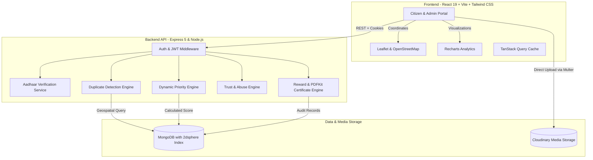

# 🏛️ CityZen (CivicPulse)

> **Next-Generation Civic Issue Reporting, Intelligent Prioritization & Community Governance Platform**

[](https://nodejs.org/)
[](https://expressjs.com/)
[](https://react.dev/)
[](https://vitejs.dev/)
[](https://tailwindcss.com/)
[](https://www.mongodb.com/)
[](https://opensource.org/licenses/ISC)

---

## 📌 Overview

**CityZen** is a GovTech civic collaboration platform that bridges the gap between citizens and municipal authorities (Urban Local Bodies). Citizens can report public infrastructure grievances—such as potholes, open manholes, contaminated water lines, overflowing waste, or malfunctioning streetlights—using pinpoint GPS coordinates and photographic evidence. 

Rather than overwhelming municipal departments with redundant reports, CityZen features an **Intelligent Engine** combining:
- **Automated Duplicate Detection** (geospatial distance + TF-IDF text similarity)
- **Dynamic Multi-Factor Priority Scoring** (severity, corroboration, community upvotes, and SLA age decay)
- **Privacy-Preserving Identity Verification** (Aadhaar OTP authentication with Verhoeff checksum validation and zero raw PII persistence)
- **Gamified Civic Rewards** (tree planting initiatives, server-generated cryptographic PDF citizenship certificates, and achievement badges)
- **Administrative Governance & Analytics Suite** (interactive priority queue, department routing, proof-of-work before/after verification, and geographic heatmaps)

---

## 🚀 Key Features

### 1. 👥 Citizen Portal
* **Intuitive Issue Reporting**: Multi-photo upload (Cloudinary) with automatic location capture and interactive OpenStreetMap/Leaflet pin placement.
* **Corroborative Upvoting**: Upvote and follow issues in the neighborhood to accelerate municipal attention.
* **Transparent Status Timelines**: Step-by-step audit trail (`Pending` → `In Progress` → `Resolved` / `Rejected`) with officer notes and timestamps.
* **Before / After Proof Slider**: Visual verification of completed municipal works using interactive comparison sliders.
* **Personalized Citizen Profile**: Displays trust score, report history, planted trees, and earned certificates.

### 2. 🧠 Intelligent Algorithms & Services
* **Automated Duplicate Detection Engine**:
  * Employs MongoDB `2dsphere` geospatial queries within a 100-meter threshold.
  * Measures text similarity between titles and descriptions using tokenized TF-IDF Cosine Similarity.
  * Automatically links confirmed duplicates as supporting corroboration to the master issue, elevating its priority without cluttering the municipal queue.
* **Dynamic Priority Scoring Engine**:
  * Multi-factor formula running on a 0–100 normalized scale:
    $$\text{Priority Score} = 0.40 \times \text{Severity} + 0.30 \times \text{Corroboration} + 0.20 \times \text{Upvotes} + 0.10 \times \text{Age}$$
  * Automatically classifies issues into **Low**, **Medium**, **High**, or **Critical (Emergency)** triage bands.
* **Citizen Trust & Reputation Scoring**:
  * Citizens maintain dynamic trust scores (0–100).
  * Legitimate, verified, and resolved reports increase trust; fraudulent, abusive, or duplicate-spamming submissions degrade reputation and throttle reporting limits.
* **Abuse & Rate-Limiting Protection**:
  * Velocity-based rate limiters (hourly & daily thresholds).
  * Automated abuse flagging with risk scores and administrative intervention workflows.

### 3. 🔒 Privacy-Preserving Identity Verification
* **Aadhaar Authentication**: Verifies citizen authenticity using a 12-digit number validated with the **Verhoeff Checksum Algorithm**.
* **Zero PII Exposure**: Raw Aadhaar numbers are **never stored** in the database. Instead, an irreversible `HMAC-SHA256` hash with server-side peppering is generated for deduplication.
* **Modular Provider Architecture**: Shipped with a development mock OTP provider that is easily switchable to production UIDAI / DigiLocker APIs.

### 4. 🌳 Civic Gamification & Rewards
* **Tree-Nation / Green India Initiative**: Auto-sponsors a tree planting in the citizen's name upon verified issue resolution.
* **Cryptographic PDF Certificates**: Dynamically generated using `PDFKit`, featuring:
  * Official Indian tricolor decorative border
  * Watermarked 24-spoke Ashoka Chakra
  * Citizen name, issue details, and unique SHA-256 validation hash
* **Citizen Badges**: Rewards active contributors with digital badges (e.g., *Responsible Citizen*).

### 5. 🏛️ Municipal Administration & Analytics
* **Intelligent Priority Queue**: Live triage dashboard prioritized by real-time dynamic urgency score.
* **Department Assignment**: Routes issues to specialized divisions (*Roads*, *Water Supply*, *Waste Management*, *Electricity Board*, *Sanitation & Health*, *General Administration*).
* **Proof-of-Resolution Upload**: Department staff must attach resolution proof photos before marking complaints resolved.
* **Automatic Status Cascading**: Resolving a master ticket automatically closes all corroborating duplicate tickets.
* **Comprehensive GovTech Analytics**:
  * Category and status distribution charts (Recharts)
  * Mean time to resolution (MTTR) tracking
  * Geospatial heatmap grid and top affected wards/areas

---

## 🏗️ System Architecture



---

## 🛠️ Tech Stack

### Frontend
- **Framework**: React 19 (Hooks, Suspense, Lazy Loading)
- **Build Tool**: Vite 6
- **Styling**: Tailwind CSS v4
- **State & Data Fetching**: TanStack React Query v5, Context API
- **Routing**: React Router v6
- **Animations**: Framer Motion, Canvas-Confetti
- **Mapping & Geolocation**: Leaflet, React-Leaflet
- **Data Visualization**: Recharts
- **Icons**: Lucide React
- **Forms & Validation**: React Hook Form, Zod

### Backend
- **Runtime**: Node.js (v18+)
- **Framework**: Express 5
- **Database & ODM**: MongoDB, Mongoose 8 (Geospatial `2dsphere` indexes, text indexes)
- **Authentication**: JWT (JSON Web Tokens), `bcryptjs`, Cookie-Parser
- **File Uploads & Storage**: Multer, Cloudinary (`multer-storage-cloudinary`)
- **Document Generation**: PDFKit (Vector rendering of Ashoka Chakra, custom tricolor margins)
- **Security & Rate Limiting**: Helmet, Express Rate Limit, HMAC-SHA256
- **Algorithm Implementations**: Verhoeff Checksum, TF-IDF Cosine Similarity, Haversine Distance

---

## 📁 Repository Structure

```
SN_BOSE/
├── backend/
│   ├── public/certificates/     # Generated PDF certificates
│   ├── src/
│   │   ├── config/              # DB, Cloudinary, priority & duplicate configurations
│   │   │   ├── cloudinary.js
│   │   │   ├── db.js
│   │   │   ├── duplicateConfig.js
│   │   │   ├── priorityConfig.js
│   │   │   └── trustConfig.js
│   │   ├── controllers/         # Express route controllers
│   │   │   ├── aadhaarAuthController.js
│   │   │   ├── abuseController.js
│   │   │   ├── adminController.js
│   │   │   ├── analyticsController.js
│   │   │   ├── authController.js
│   │   │   ├── identityController.js
│   │   │   └── issueController.js
│   │   ├── middleware/          # JWT auth, role validation, rate limiting
│   │   │   ├── aadhaarRateLimiter.js
│   │   │   ├── auth.js
│   │   │   ├── errorHandler.js
│   │   │   └── rateLimiter.js
│   │   ├── models/              # Mongoose data schemas
│   │   │   ├── AbuseFlag.js
│   │   │   ├── Department.js
│   │   │   ├── Issue.js
│   │   │   ├── Reward.js
│   │   │   ├── StatusLog.js
│   │   │   ├── Upvote.js
│   │   │   └── User.js
│   │   ├── routes/              # Express API route declarations
│   │   ├── services/            # Core business & algorithm services
│   │   │   ├── aadhaarProviders/
│   │   │   ├── aadhaarService.js
│   │   │   ├── abuseDetectionService.js
│   │   │   ├── duplicateDetectionService.js
│   │   │   ├── identityVerificationService.js
│   │   │   ├── locationSimilarityService.js
│   │   │   ├── priorityService.js
│   │   │   ├── rewardService.js
│   │   │   ├── textSimilarityService.js
│   │   │   └── trustScoreService.js
│   │   ├── utils/               # Aadhaar hash, Verhoeff, async handler, response wrappers
│   │   └── validators/          # Input schema validations
│   ├── tests/                   # Jest automated test suites
│   ├── give_rewards.js          # Utility script to test reward triggers
│   ├── migrate.js               # Database schema & priority migration script
│   ├── seed.js                  # Database seeder with realistic civic data
│   ├── server.js                # Express app entry point
│   ├── .env.example             # Backend environment template
│   └── package.json
│
├── frontend/
│   ├── public/                  # Static web assets & favicon
│   ├── src/
│   │   ├── components/
│   │   │   ├── admin/           # PriorityQueue, AbuseManagement
│   │   │   ├── charts/          # HeatmapGrid, KPICard
│   │   │   ├── citizen/         # IdentityVerificationCard
│   │   │   ├── issues/          # BeforeAfterSlider, IssueCard, StatusTimeline
│   │   │   ├── layout/          # Navbar, PageWrapper, ProtectedRoute
│   │   │   ├── map/             # MapPicker, MapView (Leaflet)
│   │   │   ├── priority/        # PriorityBadge, Legend, ProgressBar
│   │   │   ├── rewards/         # RewardWidgets
│   │   │   └── ui/              # Button, Card, Modal, Badge, Avatar, Skeleton
│   │   ├── context/             # AuthContext (state & session management)
│   │   ├── pages/
│   │   │   ├── admin/           # AdminDashboard, AnalyticsPage
│   │   │   ├── auth/            # LoginPage, RegisterPage
│   │   │   ├── citizen/         # CitizenDashboard, CreateIssuePage, IssueDetailPage, VerifyIdentityPage
│   │   │   ├── LandingPage.jsx  # Interactive product landing page
│   │   │   └── ProfilePage.jsx  # Citizen profile & reward showcase
│   │   ├── services/            # Axios API client setup
│   │   ├── App.jsx              # Routing & code splitting
│   │   ├── main.jsx             # React DOM root entry
│   │   └── index.css            # Tailwind CSS 4 styles
│   ├── index.html
│   ├── vite.config.js
│   └── package.json
│
└── README.md
```

---

## ⚙️ Getting Started

### Prerequisites
- [Node.js](https://nodejs.org/) (version 18.x or higher recommended)
- [MongoDB](https://www.mongodb.com/) (Local instance or MongoDB Atlas connection string)
- [Cloudinary Account](https://cloudinary.com/) (Required for image evidence upload)

---

### Step 1: Clone the Repository
```bash
git clone <repository-url>
cd SN_BOSE
```

---

### Step 2: Configure Environment Variables

Create a `.env` file in the `backend/` directory:

```bash
cd backend
cp .env.example .env
```

Edit `backend/.env` with your settings:

```env
# Server
PORT=8000
NODE_ENV=development
CORS_ORIGIN=http://localhost:5173

# Database (MongoDB connection URI)
MONGO_URI=mongodb://localhost:27017/cityzen

# Security / JWT
JWT_SECRET=your_super_secret_jwt_key_change_in_production

# Cloudinary (Media evidence & proof storage)
CLOUDINARY_CLOUD_NAME=your_cloud_name
CLOUDINARY_API_KEY=your_cloudinary_api_key
CLOUDINARY_API_SECRET=your_cloudinary_api_secret

# Identity Verification (Aadhaar)
AADHAAR_PROVIDER=mock
AADHAAR_HASH_SECRET=your_secret_hash_pepper_salt
AADHAAR_OTP_EXPIRY_MINUTES=5
```

---

### Step 3: Install Dependencies

#### Install Backend Dependencies
```bash
cd backend
npm install
```

#### Install Frontend Dependencies
```bash
cd ../frontend
npm install
```

---

### Step 4: Seed the Database

Populate MongoDB with realistic test departments, admin users, citizens, pre-populated issues, status histories, and upvotes:

```bash
cd ../backend
node seed.js
```

#### 🔑 Demo Accounts Generated by Seeder:
| Role | Email | Password | Access Level |
| :--- | :--- | :--- | :--- |
| **Admin Officer** | `admin@civicpulse.in` | `password123` | Full administrative control, priority queue, analytics |
| **Ward Officer** | `municipality@civicpulse.in` | `password123` | Department officer (Roads & Infrastructure) |
| **Citizen** | `citizen1@demo.com` | `password123` | Issue reporting, tracking, rewards |

---

### Step 5: Start the Development Servers

#### 1. Start the Backend API Server
```bash
cd backend
npm run dev
# Server will run on: http://localhost:8000
```

#### 2. Start the Frontend Development Server
In a separate terminal:
```bash
cd frontend
npm run dev
# Frontend will be live on: http://localhost:5173
```

Open [http://localhost:5173](http://localhost:5173) in your browser to experience CityZen.

---

## 🧪 Running Tests

The backend includes a Jest test suite verifying the Verhoeff checksum algorithm, Aadhaar OTP mock generation, and irreversible HMAC hashing:

```bash
cd backend
npm test
```

---

## 📡 API Reference Overview

### 🔐 Authentication (`/api/auth`)
| Method | Endpoint | Description | Auth Required |
| :--- | :--- | :--- | :--- |
| `POST` | `/api/auth/register` | Register new user account | Public |
| `POST` | `/api/auth/login` | Log in and receive JWT token | Public |
| `POST` | `/api/auth/refresh` | Refresh access token via cookie | Public |
| `POST` | `/api/auth/logout` | Invalidate user session | Public |
| `GET` | `/api/auth/me` | Fetch authenticated user profile | Yes |
| `POST` | `/api/auth/aadhaar/request-otp` | Request OTP for Aadhaar verification | Public / Optional |
| `POST` | `/api/auth/aadhaar/verify-otp` | Verify Aadhaar OTP & validate Verhoeff | Public / Optional |

### 📋 Issues (`/api/issues`)
| Method | Endpoint | Description | Auth Required |
| :--- | :--- | :--- | :--- |
| `GET` | `/api/issues` | List paginated public issues (filters & search) | Public |
| `GET` | `/api/issues/my` | List issues submitted by current user | Citizen |
| `GET` | `/api/issues/:id` | Get single issue details, updates & upvote status | Public / Optional |
| `POST` | `/api/issues` | Create new issue report (with duplicate & abuse check) | Citizen (Verified) |
| `PUT` | `/api/issues/:id` | Update pending issue description/location | Owner |
| `DELETE` | `/api/issues/:id` | Delete pending issue and uploaded assets | Owner / Admin |
| `POST` | `/api/issues/:id/upvote`| Upvote or remove upvote on an issue | Citizen |

### 🏛️ Administration (`/api/admin`)
| Method | Endpoint | Description | Auth Required |
| :--- | :--- | :--- | :--- |
| `GET` | `/api/admin/issues` | Get all issues with priority sorting & duplicates | Admin |
| `GET` | `/api/admin/stats` | Get KPI metrics and MTTR resolution stats | Admin |
| `GET` | `/api/admin/departments`| List all municipal departments | Admin |
| `PATCH`| `/api/admin/issues/:id/assign` | Assign issue to department/officer | Admin |
| `PATCH`| `/api/admin/issues/:id/status` | Update status, upload resolution proof, trigger rewards | Admin |

### 📊 Analytics (`/api/analytics`)
| Method | Endpoint | Description | Auth Required |
| :--- | :--- | :--- | :--- |
| `GET` | `/api/analytics/category-distribution` | Breakdown of complaints by category | Admin |
| `GET` | `/api/analytics/status-distribution` | Resolution status breakdown | Admin |
| `GET` | `/api/analytics/trends` | Submission and resolution trend over time | Admin |
| `GET` | `/api/analytics/resolution-time` | Average resolution days per category | Admin |
| `GET` | `/api/analytics/heatmap` | Geographic coordinate density data | Admin |
| `GET` | `/api/analytics/top-areas` | Hotspot wards and areas with highest volume | Admin |

### 🎁 Rewards (`/api/rewards`)
| Method | Endpoint | Description | Auth Required |
| :--- | :--- | :--- | :--- |
| `GET` | `/api/rewards/my` | Fetch user's trees, certificates, and badges | Citizen |

### 🛡️ Abuse Management (`/api/admin/abuse`)
| Method | Endpoint | Description | Auth Required |
| :--- | :--- | :--- | :--- |
| `GET` | `/api/admin/abuse/flags` | List flagged suspicious users & submissions | Admin |
| `POST`| `/api/admin/abuse/:id/review` | Review flag, adjust trust score, take action | Admin |

---

## 🛡️ Security & Privacy Features

- **Aadhaar Privacy Preservation**:
  - The platform adheres to data minimization principles. Raw 12-digit Aadhaar numbers are never persisted to disk or database.
  - Hashing uses an irreversible `HMAC-SHA256` digest combined with a secret server pepper (`AADHAAR_HASH_SECRET`).
  - Numbers are validated mathematically before transmission using the Verhoeff check digit algorithm.
- **Protection Against Orphan Storage**:
  - If an issue submission fails validation or is flagged as abusive after file reception, the backend automatically purges uploaded images from Cloudinary storage.
- **Granular Multi-Tier Rate Limiting**:
  - API-wide rate limiting (`apiLimiter`).
  - Strict authentication and login attempt limits (`authLimiter`).
  - Aadhaar OTP request rate throttling (`aadhaarOtpRateLimiter`).
  - Issue submission velocity throttling per user (`issueSubmissionLimiter`).

---

## 🔮 Roadmap & Future Enhancements

- [ ] **AI Computer Vision Pipeline**: Automatic image similarity clustering to detect visual duplicates of potholes or waste piles using image embeddings.
- [ ] **DigiLocker & UIDAI Official Gateway**: Direct integration with production OAuth/OpenID Connect identity infrastructure.
- [ ] **Automated SMS & WhatsApp Alerts**: Real-time notifications via Twilio / Gupshup when status updates occur.
- [ ] **Offline-First PWA Mode**: Progressive Web App support enabling issue draft caching in remote areas with unstable connectivity.

---

## 📄 License

This project is licensed under the [ISC License](https://opensource.org/licenses/ISC).
